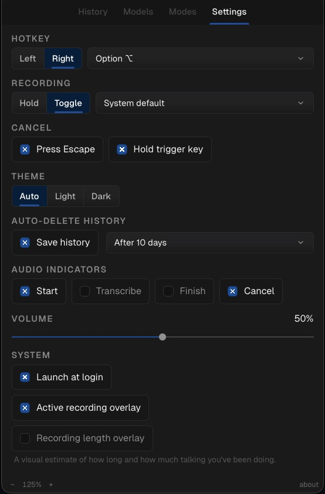
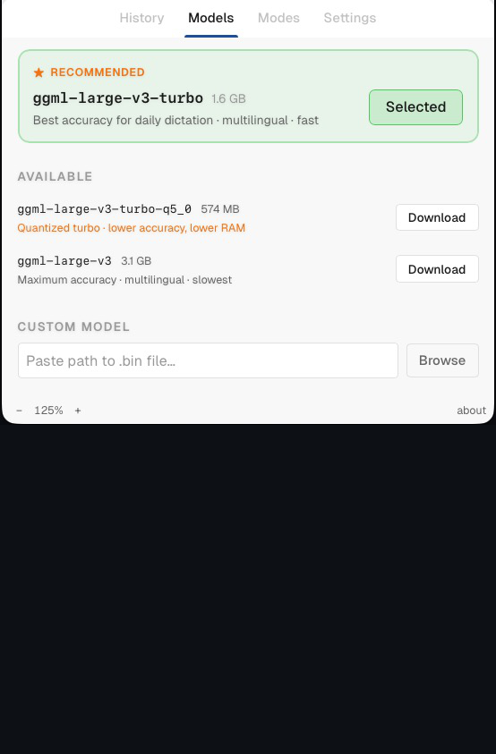

<p align="center">
  
</p>

<h1 align="center">Turbo Talk</h1>

<p align="center"><strong>Free voice dictation for getting work done.</strong></p>

<p align="center">
  
  
  
</p>

<p align="center">
  <a href="https://github.com/eldo9000/TurboTalk-App/releases">
    
  </a>
</p>

---

<table>
  <tr>
    <td align="center">
      <p></p>
      <p><sub>Whisper model selection</sub></p>
    </td>
    <td align="center">
      <p></p>
      <p><sub>Hotkey, recording, and system settings</sub></p>
    </td>
  </tr>
  <!-- Drop docs/assets/ss3.jpg in and uncomment for the full triple matrix:
  <tr>
    <td colspan="2" align="center">
      <p></p>
      <p><sub>Caption here</sub></p>
    </td>
  </tr>
  -->
</table>

---

## Overview

Push-to-talk voice dictation. Hold a hotkey, speak, release — your transcript pastes into whatever app has focus. Transcription runs locally via Whisper. Optional cleanup pass runs through a local Ollama model.

### History

The last 50 dictations live on the History tab. Click an entry to copy it. Retention is configurable (`restart`, `1d`, `5d`, `10d`, `30d`); the cap of 50 entries applies regardless.

### UI zoom

`Cmd+=` / `Cmd+−` (Ctrl on Win/Linux) zoom the UI in 25% steps from 100% to 200%. `Cmd+0` / `Ctrl+0` resets. The level persists across launches.

### Models

Three Whisper models ship from the Models tab:

| Model | Size | Notes |
|---|---|---|
| **large-v3-turbo** *(recommended)* | 1.6 GB | Default. Fast, accurate, multilingual. Suitable for most daily use. |
| large-v3-turbo-q5_0 | 574 MB | Quantized. Smaller footprint, slight accuracy tradeoff. |
| large-v3 | 3.1 GB | Highest accuracy, slower. |

If you already have a Whisper `.bin` you prefer, paste its path in Settings — it'll be used as-is.

### Trigger key & window behavior

- **Trigger key** is configurable as press-and-hold or toggle. On macOS: left or right Option, Control, Command, Shift, or any numpad key. On Windows/Linux: Alt, Ctrl, Shift, Win/Super, or numpad keys.
- **State indicator** in the titlebar and tray reflects Recording / Transcribing.
- **Closing the window hides to tray.** The hotkey stays live. Quit from the tray menu to fully exit.
- **Error toasts** include specifics (e.g. recording duration, which permission is missing) and deep-link to the relevant system settings pane where applicable.

### Cleanup modes

Three options for how the transcript is post-processed before paste:

- **Off** — paste Whisper's raw output.
- **Simple** — capitalize the first letter, strip filler words and Whisper artifacts. Local-only, no model.
- **Advanced** — route through a local Ollama model that classifies the context (prose / code / shell) and formats accordingly. Vocabulary and classifier prompt are user-editable.

---

## Implementation notes

- **Local-only.** No cloud calls, no telemetry, no analytics. Enforced at the architecture level — there are no remote SDKs in the dependency graph.
- **Security review.** IPC boundaries, file reads, shell invocations, and untrusted-input paths have been audited for the standard bug classes.
- **Recorder is a single-job state machine.** Rapid hotkey presses, focus changes mid-recording, and audio-device disconnects each have an explicit handler. Failures surface as a banner rather than a hang; a second recording can't race the first one's paste.
- **Fixed audio pipeline.** Every recording hits the same chain before Whisper: downmix → resample to 16 kHz → voice-activity trim → loudness normalize → WAV. Each stage is timed per dictation.
- **Advanced cleanup is user-configurable.** Vocabulary list, classifier prompt, and per-context formatting (prose / code / shell) are all editable. Off and Simple modes are available if Ollama isn't installed.

---


## Install — macOS

1. Download the DMG from the [releases page](https://github.com/eldo9000/TurboTalk-App/releases) and drag `Turbo Talk.app` into `/Applications`.
2. First launch: **right-click → Open**. GitHub-downloaded beta builds are unsigned/not notarized and carry macOS's download quarantine flag, so a normal double-click may show "Apple could not verify Turbo Talk.app" and refuse to open.
3. Walk through the three-step onboarding wizard: grant Accessibility → grant Microphone → pick a transcription model.
4. Open Settings, set your trigger key, choose hold-to-talk or toggle.
5. Open TextEdit, hold the trigger key, say "hello world", release — your sentence appears at the cursor.

If right-click → Open is still blocked, open System Settings → Privacy & Security and choose **Open Anyway** for Turbo Talk. This warning is expected until the beta is Developer ID signed and notarized.

## Install — Windows

> Experimental packaging only. CI can build the Windows installer and bundled Whisper sidecar, but the Windows hotkey and paste implementations are still stubs, so the dictation loop is not release-ready on Windows yet.

1. Download `TurboTalk-<version>-windows-x64-setup.exe` from the releases page.
2. Double-click. Windows SmartScreen will show **"Windows protected your PC"** because the installer is unsigned. Click **More info → Run anyway** to proceed.
3. Complete the NSIS installer.
4. If the app fails to launch with a WebView2 error (most common on Windows 10), install the WebView2 Evergreen runtime from <https://developer.microsoft.com/microsoft-edge/webview2/>. Windows 11 ships with it preinstalled.
5. Launch TurboTalk from the Start menu only for packaging/runtime inspection. End-to-end dictation is blocked until Windows hotkey + paste land.

## Install — Linux (X11)

> Beta in progress — once the Linux sidecar binary is bundled, the AppImage will appear on the releases page.

1. **Confirm you are on an X11 session.** Run `echo $XDG_SESSION_TYPE` — it must print `x11`. If it prints `wayland`, log out and pick the "Xorg" or "X11" variant of your desktop at the login screen. See the Wayland note below.
2. Install FUSE if your distro doesn't have it: `sudo apt install libfuse2` (Debian/Ubuntu) or your distro's equivalent. AppImage requires FUSE to run.
3. Download `TurboTalk-<version>-linux-x64.AppImage`, mark it executable, and run it:

   ```bash
   chmod +x TurboTalk-<version>-linux-x64.AppImage
   ./TurboTalk-<version>-linux-x64.AppImage
   ```

4. Complete onboarding, set your trigger key.
5. Open `gedit` (or any text editor), hold the trigger key, say "hello world", release — your sentence appears at the cursor.

### Wayland note

Wayland is not supported and is not on the roadmap for this beta. Wayland compositors deliberately block the kind of system-wide keystroke injection TurboTalk needs to paste your transcript into the focused app — that's a security feature of the protocol, not an app bug. On X11, those primitives (`xtest` / `XSendEvent`) work; on Wayland, the compositor refuses them and there is no portable replacement. If your distro defaults to Wayland, log out and choose the X11 / Xorg variant of your desktop at the login screen.

---

### Permissions the app will request

The onboarding wizard walks you through whatever your platform requires. You should never have to find these manually.

**macOS**

- **Microphone** — to capture audio while you hold the trigger key.
- **Accessibility** (System Settings → Privacy & Security → Accessibility) — required twice over: (1) for the global push-to-talk hotkey, which uses a `CGEventTap` to observe modifier-key flag changes, and (2) for the paste step, which sends `Cmd+V` to the focused app via `System Events`. If you see a `paste-error` toast saying "check Accessibility permission", this is why.

No other macOS system permissions are requested. There is no Automation prompt per app, no Full Disk Access, no Screen Recording.

**Windows**

- **Microphone** — Settings → Privacy & security → Microphone. Windows will prompt the first time TurboTalk records.
- No other system permissions are needed. Global hotkey + paste injection do not require any explicit grant on Windows.

**Linux (X11)**

- No system permissions are requested. PulseAudio/PipeWire grants mic access by default, and X11 allows the global hotkey + paste injection without explicit per-app permission.

### Local data

- **Config + history (macOS):** `~/.config/librewin/turbotalk/` — holds `config.toml` (settings) and `history.json` (last 50 dictations).
- **Config + history (Windows):** `%APPDATA%\librewin\turbotalk\` — same files.
- **Config + history (Linux):** `~/.config/librewin/turbotalk/` — same files.
- **Whisper models:** under the same `librewin/turbotalk/models/` directory — `.bin` files downloaded via the Models tab live here.
- **Audio temp files:** `turbotalk-*.wav` written to the system temp dir (`/tmp` on macOS/Linux, `%TEMP%` on Windows) for each dictation. Each file is deleted automatically the moment its dictation finishes — successful, failed, or cancelled.
- **Delete everything:** quit from the tray, then delete the `librewin/turbotalk/` directory listed for your platform above.

### Known limitations

- **macOS:** Apple Silicon only. Ad-hoc signed only — not Apple-notarized. Expect a Gatekeeper warning on first launch (right-click → Open the first time).
- **Windows:** Installer packaging exists, but end-to-end dictation is not supported yet. Hotkey + paste are still unsupported off macOS. The `.exe` is unsigned, so SmartScreen warns on first run. WebView2 runtime is required (preinstalled on Windows 11; Windows 10 users may need <https://developer.microsoft.com/microsoft-edge/webview2/>).
- **Linux:** X11 only — **Wayland is not supported.** AppImage requires FUSE (`libfuse2` on Debian/Ubuntu). Tray-icon support depends on your desktop's AppIndicator support (GNOME may need an extension).
- **All platforms:** No auto-updater. Re-download to update.
- History is saved to disk by default, retained for 10 days. Configurable in Settings — choose `restart` (clear on launch), `1d`, `5d`, `10d`, or `30d`. Capped at 50 entries either way.
- The Advanced cleanup mode requires a local Ollama install. If you don't run Ollama, leave cleanup on `Off` or `Simple`.

### Feedback

Personal-use beta — feedback by direct message until a public tracker opens.
